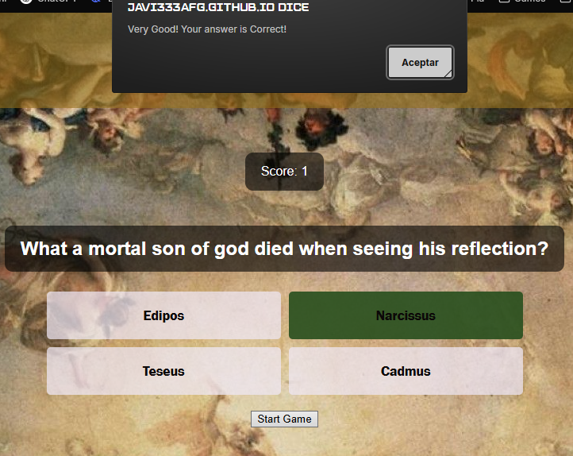
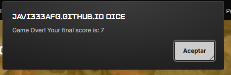

# Mythological Trivial

Mythological Trivial is a simple quiz game based on Greco-Roman mythology.  
The game presents 10 questions, each with 4 possible answers. Your score is updated as you play, and at the end you’ll see your final results.

---

## Features

### Gameplay
- **Player name**: To register the player's name, fill the name box.
- **Start Game**: Once with the right name filled clicking on "Start Game" begins the quiz.
- **Interactive Questions**: Each question offers 4 multiple-choice answers.

- **Immediate Feedback**: After selecting an answer, an alert tells you if you are correct or shows the correct answer.
 

- **Score Tracking**: Your score increases with every correct answer.

- **Game End Screen**: When all 10 questions are answered, your final score is displayed and the game resets so you can play again.

## Defensive Design & Accessibility

No early interaction: Answer buttons are disabled (and/or hidden) until the game starts.

Shuffled answers: Options are randomized per question to avoid pattern memorization.

Dynamic updates: Question text and score update live on screen.

(Optional) Player name before starting, with basic validation and error messaging via aria-live.

### Design
- Header with the game title

- Clean and simple interface.
- Responsive layout adaptable to desktop and mobile.
- Mythology-themed background.
- Footer with links to social media.

---

## Technologies Used

- **HTML5** – Structure of the page.
- **CSS3** – Styling and layout.
- **JavaScript (Vanilla)** – Game logic and interactivity.

---

## Deployment

Live Site (GitHub Pages): 
[GitHub Repository](https://github.com/Javi333afg/Mythological-Trivial)

---

## Testing

- **Functional tests**

- No interaction before start
Steps: Load the page → Try clicking answers.
Expected: Answer buttons remain disabled/hidden until the game starts. 

- Start game flow
Steps: Click Start Game (and, if enabled, enter a valid name first).
Expected: First question appears; buttons enabled; score resets to 0. 

- Answer handling
Steps: Choose an answer (wrong, then correct).
Expected: Immediate feedback via alerts; score only increases on correct answers. 

- Progression & end
Steps: Answer all questions.
Expected: Final score alert; answers hide/disable; you can start a new game. 

- Replay
Steps: Click Start Game again.
Expected: Game resets to question 1 with score 0. 

- (Optional) Player name validation
Steps: Enter fewer than 2 characters → Start stays disabled; enter ≥ 2 → Start enabled.
Expected: Defensive design prevents starting without a valid name; error message announced. 

- W3C Markup Validator and CSS Validator.
 

- I tested with lighthouse the website.

**Cross-browser/device**

Tested on Chrome, Firefox, Safari (desktop).

Checked responsive layout with mobile presets in DevTools (phone/tablet).

## Credits

- Background image: [Unsplash](https://unsplash.com/) (Gods theme image)  
- Icons: [Font Awesome](https://fontawesome.com/)  
- Favicon: helmet.png from [Flaticon](https://www.flaticon.com/)  
