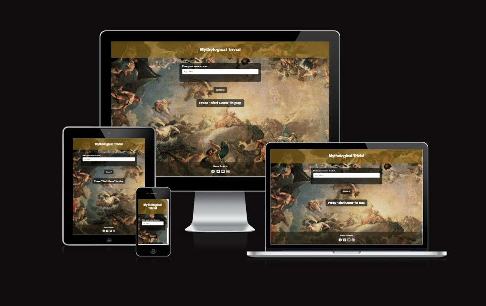
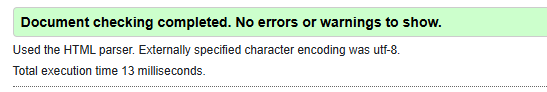
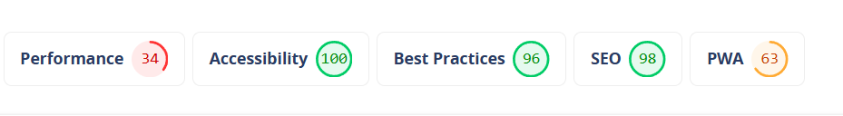

# Mythological Trivial

Mythological Trivial is a simple quiz game based on Greco-Roman mythology.  
The game presents 10 questions, each with 4 possible answers. Your score is updated as you play, and at the end you’ll see your final results.

---

## Features

### Gameplay

- **Start Game**: Clicking on "Start Game" begins the quiz.
- **Interactive Questions**: Each question offers 4 multiple-choice answers.
- **Immediate Feedback**: After selecting an answer, an alert tells you if you are correct or shows the correct answer.
 

- **Score Tracking**: Your score increases with every correct answer.
- **Game End Screen**: When all 10 questions are answered, your final score is displayed and the game resets so you can play again.

### Design

- Clean and simple interface.
- Responsive layout adaptable to desktop and mobile.
- Mythology-themed background.
- Footer with links to social media.

---

## Screenshots

### Header

### Gameplay

### Footer

---

## Technologies Used

- **HTML5** – Structure of the page.
- **CSS3** – Styling and layout.
- **JavaScript (Vanilla)** – Game logic and interactivity.

---

## Deployment

You can see the code here:  
[GitHub Repository](https://github.com/Javi333afg/Mythological-Trivial)

---

## Testing

- I tested that this page works in different browsers: Chrome, Firefox, Safari.
- I confirmed that the social media links open in new tabs.
- I tested in the W3C Markup Validator and CSS Validator.

- I tested with lighthouse the website.
